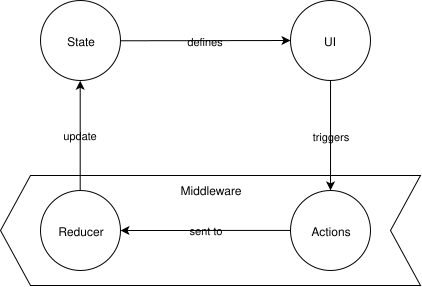
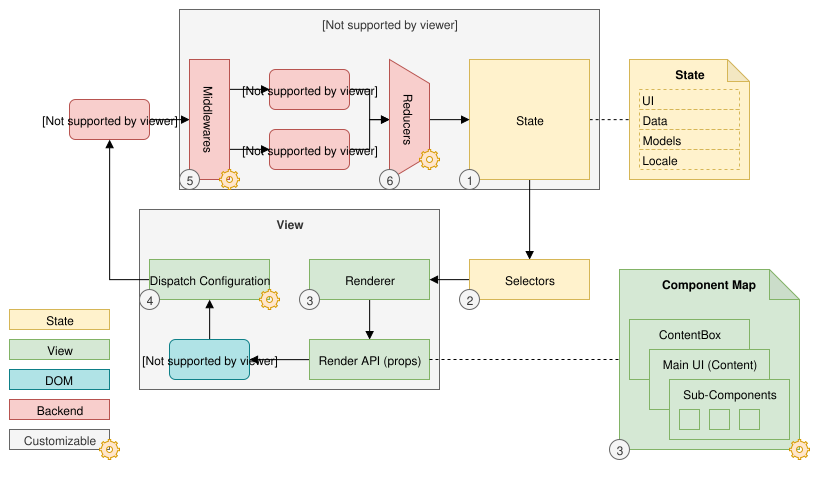

////
SPDX-License-Identifier: EUPL-1.2 OR LicenseRef-commercial

Copyright (c) 2012-2026 mgm technology partners GmbH

Dual License
------------
This source file is part of the mgm A12 Platform and available under
a choice of two different licenses:

1. Open-Source License – EUPL v1.2
   You may redistribute and/or modify this file under the terms of the
   European Union Public License, version 1.2 - see https://eupl.eu/.

2. Commercial License
   Alternatively, you may obtain a commercial license from
   mgm technology partners GmbH, that permits use of this software
   under different terms (including support and maintenance services).

   Please contact a12-license@mgm-tp.com for more information.

You must select and comply with exactly one of the above license options.

Warranty Disclaimer (applies to either option)
----------------------------------------------
THIS SOFTWARE IS PROVIDED "AS IS" AND WITHOUT WARRANTY OF ANY KIND,
WHETHER EXPRESS OR IMPLIED, INCLUDING BUT NOT LIMITED TO THE WARRANTIES
OF MERCHANTABILITY, FITNESS FOR A PARTICULAR PURPOSE AND
NON-INFRINGEMENT, EXCEPT WHERE SUCH DISCLAIMERS ARE HELD TO BE
LEGALLY INVALID. SEE THE RESPECTIVE LICENSE TEXT FOR DETAILS.
////

= Architecture

The Form Engine runtime follows the general Redux architecture. Therefore, it consists of two major parts, which are strictly separated: view and behavior.

The behavior part defines and manages the state of the Form Engine. It is implemented as a Redux middleware and defines how event-actions lead to state changes.

The view part displays the state and forwards UI events (user input) back to the behavior part. It is implemented as a Redux connected React component and defines how a given state (and configuration) manifests itself in the (React virtual) DOM. It also defines which actions are dispatched as a consequence of UI (DOM) events.

The following image gives an overview about the architecture of the Form Engine:

. The Redux state holds the current state of the engine. It contains information about the UI-state (validation messages, location, ect.), data, and models. (<<form-engine_state,State>>)
. The selectors return parts from the state and are used to create the props for the renderer.
. The renderer traverses the Form Model and uses React components to render. Render components can be replaced by customizing the component map. It contains entry per Form Model element. The component has access to all models, data, and configuration. (<<form-engine_rendering,Rendering>>)
. The `DispatchConfiguration` maps an UI-event to an event-action. (<<form-engine_events_and_actions,Events and Actions>>)
. Event-actions are processed in middlewares, which dispatch command-actions to trigger a state change. (<<form-engine_events_and_actions,Events and Actions>>)
. Command-actions are handled in reducers, which change the state. (<<form-engine_events_and_actions,Events and Actions>>)

== View

The view of the Form Engine (lower half in the diagram) is exposed as a model-driven React component, which needs to be connected to a Redux store. Connected means that it depends on Redux as its higher-level infrastructure. Model-driven means that it relies on A12 Models and Documents.

User interactions are propagated as event callback functions from the internal React components into the connect infrastructure where they are translated to Redux actions.

The internal React components only contain short-lived, pure UI state like "date picker opened".

The view is separated into several components to allow customizing and modularization:

* *FormModelMap:* Assignment of Form Model elements to React components that render them. These React components have a common props API that includes the Form Model element, the event callbacks and the general engine configuration.
* *Engine ContentBox:* React component that renders the `ContentBox` of the Engine.
* *Engine ScrollHandler:* React component that renders a `ScrollHandler` which takes care of focusing elements and scrolling to them.

== Behavior

The behavior of the engine consists of its runtime configuration that is defined by the Redux state, and its dynamic behavior is implemented as Redux functions, i.e. actions, middleware, reducer, and selectors.

The _state_ represents all significant properties of the engine's domain, e.g. data, selection state and validation state. Therefore, its structure is aligned to the engine domain.
Note: Pure UI state has no meaning outside the respective UI component and is kept in its React state. Therefore, the engine does not provide any access to this kind of state.

The engine _actions_ are divided into two types: _events_ and _commands_. 

<<form-engine_events_and_actions_events, Events>> signal that something has happened in the UI, triggered by a user interaction. For example a click on a button or typing into an input.
They are handled by middlewares and will never change the state directly. They can be dispatched by users, for example "Events.addRow" when a repeat row should 
be added programmatically. You are also encouraged to listen to them, for example to "Events.eventButton" to get notified about a button click.

<<form-engine_events_and_actions_commands, Commands>> are used to directly modify the Redux state. They are dispatched by other Events/Commands and are usually implemented in reducers. Users are encouraged
to dispatch them, for example "Commands.setDisabled" to disable the UI, but are *NOT* encouraged to listen to them. Which commands are dispatched in what order
and by what user interaction is considered an implementation detail and a change is not considered breaking.

The _middlewares_ serve two purposes:

* based on the state, it translates an event into one or more commands
* it is a convenient extension point to customize engine behavior.

The _reducers_ contain the code to mutate the state. It is primarily a technical necessity. However, it is important to know that the reducers must be adapted to different store structures.

The _selectors_ are used to select different properties from the state. Like reducers, they must be aligned to the store structure, e.g. to the Client where for example models are kept in a different structure. In addition, selectors can be used when the data or models cannot be stored in the standard way, e.g. in case of lazy loading or dynamic transformation of models and data.

*Why is the state kept as pure data?*

This is necessary for the Redux state change detection and rendering. It also allows easy replacement of any part of the state without dependencies to additional code.

*Why are actions separated into events and commands?*

This helps to understand the engine's runtime behavior better, because you can rely on the effect of actions only creating other actions or changing the state. This makes maintenance, customizing, and debugging easier.

It also serves as a reminder not to listen to commands when you want to react to some user interaction. Which event is dispatched by what user interaction is fixed. Which commands are dispatched as a result might change and should not be relied on.

*Why are middlewares, reducers, and selectors used?*

Short answer: Client is based on Redux.

Using Redux to implement engine behavior allows a frictionless integration into existing Redux based architectures like Client:

* The state that drives the engine's UI can simply be controlled and modified using Redux means. Without such infrastructure, the state is either intrinsic to the engine (not a viable solution) - or a state merge must be conducted which can become error-prone and might need to deal with ambiguous situations.
* Parts of middleware, reducer, and selectors can be replaced by own implementations to achieve custom behavior and different ways of data handling like dynamic transformations and lazy loading.

The usage of pure data structures for all state also makes complex state changes more robust and flexible, because there is no risk of stale data, invalid references, and memory leaks. This ultimately makes customizing the engine behavior simpler, also without Client.
