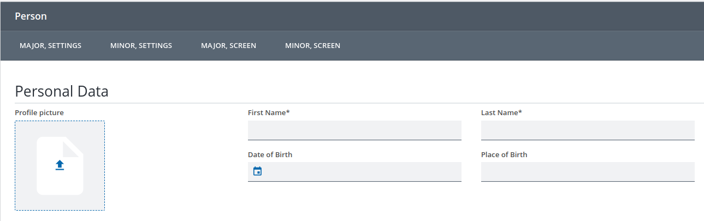

////
SPDX-License-Identifier: EUPL-1.2 OR LicenseRef-commercial

Copyright (c) 2012-2026 mgm technology partners GmbH

Dual License
------------
This source file is part of the mgm A12 Platform and available under
a choice of two different licenses:

1. Open-Source License – EUPL v1.2
   You may redistribute and/or modify this file under the terms of the
   European Union Public License, version 1.2 - see https://eupl.eu/.

2. Commercial License
   Alternatively, you may obtain a commercial license from
   mgm technology partners GmbH, that permits use of this software
   under different terms (including support and maintenance services).

   Please contact a12-license@mgm-tp.com for more information.

You must select and comply with exactly one of the above license options.

Warranty Disclaimer (applies to either option)
----------------------------------------------
THIS SOFTWARE IS PROVIDED "AS IS" AND WITHOUT WARRANTY OF ANY KIND,
WHETHER EXPRESS OR IMPLIED, INCLUDING BUT NOT LIMITED TO THE WARRANTIES
OF MERCHANTABILITY, FITNESS FOR A PARTICULAR PURPOSE AND
NON-INFRINGEMENT, EXCEPT WHERE SUCH DISCLAIMERS ARE HELD TO BE
LEGALLY INVALID. SEE THE RESPECTIVE LICENSE TEXT FOR DETAILS.
////

= Buttons

== Kinds of Buttons

* *EventButton:* Triggers a generic event identified by a name (string). The event has to be handled by the application.
* *NavigationButton:* Navigates to the given Screen (also supports previous and next). If the validate options is set, the button will trigger a partial validation and only proceed when the validation yields a valid result.

== Button Panels

Button Panels are screen elements, which can be placed next to ControlGrids, Sections or Repeats.

They can contain any number of buttons.

== Sub-Header and Footer Buttons

Each form has a sub-header and footer box, where you can place buttons, which are shown on every Screen.

Each Screen has a sub-header and footer box, where you can place buttons, which will be shown in addition to the form buttons if you are on that Screen.

[NOTE]
====
Detached Repeat Screens are also Screens, but here two additional rules apply:

* the footer is reserved for the Detached Repeat buttons
* navigation buttons do not work
====

Each button can either be in a major or minor area of the sub-header or footer, which affects the position and order of the buttons.
In general, major and minor buttons are rendered according to the link:/docs/PLASMA/plasma-concept-documentation/index.html#_major_and_minor_area[Plasma guidelines].
Inside one of these areas, buttons defined for the form are rendered before the buttons defined for the screen.

The exception are *NavigationButtons* in the sub-header, where all buttons are rendered next to each 
other in the navigation menu. Here, all form and screen buttons are grouped together, with form buttons in front. In one group, 
major buttons are rendered before minor buttons. See the following image for an example:

