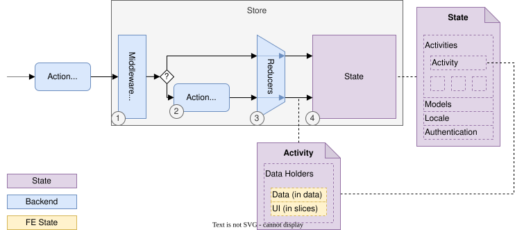
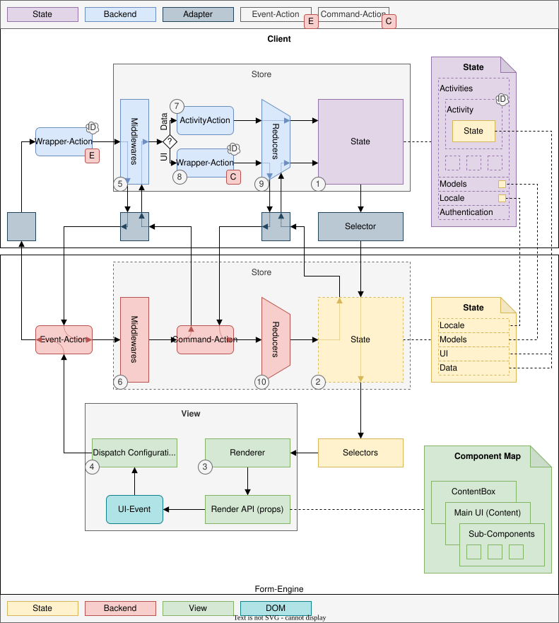

////
SPDX-License-Identifier: EUPL-1.2 OR LicenseRef-commercial

Copyright (c) 2012-2026 mgm technology partners GmbH

Dual License
------------
This source file is part of the mgm A12 Platform and available under
a choice of two different licenses:

1. Open-Source License - EUPL v1.2
   You may redistribute and/or modify this file under the terms of the
   European Union Public License, version 1.2 - see https://eupl.eu/.

2. Commercial License
   Alternatively, you may obtain a commercial license from
   mgm technology partners GmbH, that permits use of this software
   under different terms (including support and maintenance services).

   Please contact a12-license@mgm-tp.com for more information.

You must select and comply with exactly one of the above license options.

Warranty Disclaimer (applies to either option)
----------------------------------------------
THIS SOFTWARE IS PROVIDED "AS IS" AND WITHOUT WARRANTY OF ANY KIND,
WHETHER EXPRESS OR IMPLIED, INCLUDING BUT NOT LIMITED TO THE WARRANTIES
OF MERCHANTABILITY, FITNESS FOR A PARTICULAR PURPOSE AND
NON-INFRINGEMENT, EXCEPT WHERE SUCH DISCLAIMERS ARE HELD TO BE
LEGALLY INVALID. SEE THE RESPECTIVE LICENSE TEXT FOR DETAILS.
////

[#form-engine_integration_client_form_engine_and_activities]
= State Integration

== Initializing of an Activity

The following image shows how an activity, which should be used to display a Form Engine, is initialized.

. The saga from the Form Engine extension listens to the _push-action_ that belongs to a scene with a modelType `form`.
. The saga merges the default initial UI state with the provided partial ui state in the `slices.uiState` property and triggers an internal action to set the UI state.
. The internal action is handled by the normal middlewares and reducers.
. In the end the newly created activity contains the default DataHolder, that contains the loaded data and a complete UI state slice.

== Updating of an Activity

The following image shows the interaction between Form Engine and the Client. It is assumed that the activity is already initialized.

. The Client state contains all information which are necessary to render the Form Engine for a specific form
* an activity holding the document (data.document prop) and the Form Engine UI state (slices.ui prop) in its default DataHolder
* the Form Model and Document Model
* the locale
. When connecting the view the internal Form Engine state is created by using the _FormEngineSelectors_.
. The renderer traverses the Form Model and uses React components to render.
. Event-actions which are dispatched by the Form Engine are wrapped in a Client action by the _Event-Action Dispatch Adapter_. The new action contains, next to the original event-action, the activity-id. This is necessary to be able to map changes in the back-end to the activity which contains the engine state.
. The Client action is handled by the _Middleware-Adapter_. This adapter calls all middlewares from the Form Engine with the wrapped event-action.
. For each event-action, one or more command-actions are dispatched by the Form Engine middlewares.
. If the command-action signals a data change (e.g. `setDocument`), the corresponding _ActivityAction_ is dispatched by the _Middleware-Adapter_.
. If the command-action signals a UI-state change, a Client action which wraps the command-action is dispatched by the _Middleware-Adapter_.
. The Client action is treated be the _UI-state Reducer Adapter_, which extracts the wrapped command-action and gives it to the UI-state reducer of the Form Engine.
. The UI-state reducer of the Form Engine changes the given state and returns it to the _engine Reducer Adapter_ which then changes the ui slice in the slices property of the default DataHolder in the activity.
