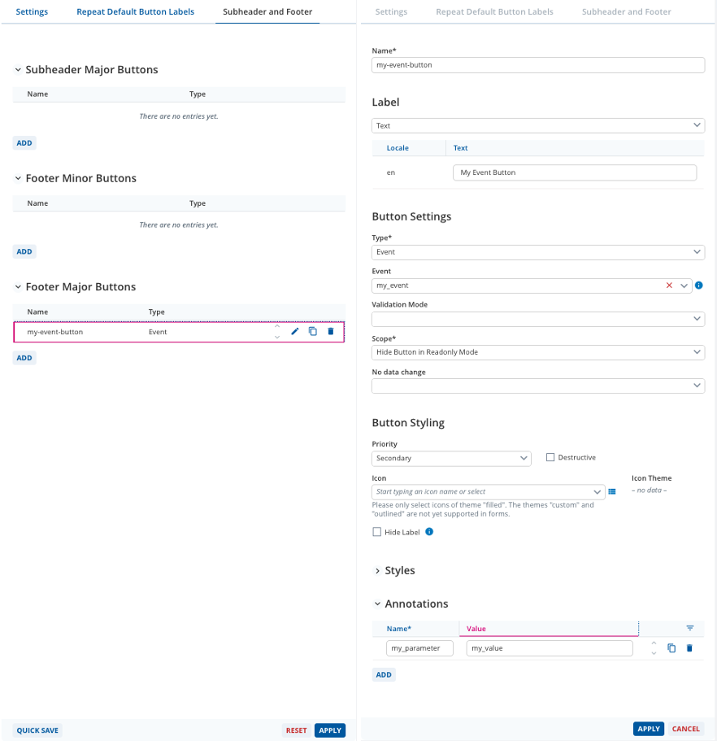

////
SPDX-License-Identifier: EUPL-1.2 OR LicenseRef-commercial

Copyright (c) 2012-2026 mgm technology partners GmbH

Dual License
------------
This source file is part of the mgm A12 Platform and available under
a choice of two different licenses:

1. Open-Source License - EUPL v1.2
   You may redistribute and/or modify this file under the terms of the
   European Union Public License, version 1.2 - see https://eupl.eu/.

2. Commercial License
   Alternatively, you may obtain a commercial license from
   mgm technology partners GmbH, that permits use of this software
   under different terms (including support and maintenance services).

   Please contact a12-license@mgm-tp.com for more information.

You must select and comply with exactly one of the above license options.

Warranty Disclaimer (applies to either option)
----------------------------------------------
THIS SOFTWARE IS PROVIDED "AS IS" AND WITHOUT WARRANTY OF ANY KIND,
WHETHER EXPRESS OR IMPLIED, INCLUDING BUT NOT LIMITED TO THE WARRANTIES
OF MERCHANTABILITY, FITNESS FOR A PARTICULAR PURPOSE AND
NON-INFRINGEMENT, EXCEPT WHERE SUCH DISCLAIMERS ARE HELD TO BE
LEGALLY INVALID. SEE THE RESPECTIVE LICENSE TEXT FOR DETAILS.
////

[#form-engine_tutorials_event_handling]
= Custom Event Handling With Buttons and Row Actions

This chapter contains examples of how annotated event buttons or custom Row Action buttons can be used to trigger project-specific functionality.

== Event Buttons

=== Form Model

An annotation must be added to a Form Model button. It can be any event button, e.g. in the form subheader / footer, the Screen subheader / footer,
a Button Panel or a even custom Repeat Row Action. In this example a form footer button is used.

Whenever this button is clicked by the user, the `DispatchConfiguration.onEventButton()` function is called and an `eventButton` action is dispatched. The action payload contains the event name and a `ModelPath` to the button.
In case of Row Actions, a `customRowAction` action would be dispatched instead. This action contains the event name, the path to the affected row (a `DocumentPath`) and the path to the affected Repeat (a `ModelPath`).

=== Customized Event Handling

In order to add custom event handling logic, an additional `onEventButtonClickedMiddleware` must be implemented and registered.

[source,tsx]
----
include::assets/typescript/form-engine/tutorials/event-button/onEventButtonClickedMiddleware.ts[tags=annotated-button]
----

== Custom Row Actions
In order to add logic for a custom Row Action button, an additional `onRowActionClickedMiddleware` must be implemented and registered.

[source,tsx]
----
include::assets/typescript/form-engine/tutorials/row-action-button/onRowActionClickedMiddleware.ts[tags=middleware]
----

Whenever a Row Action is executed in an Embedded Repeat, the currently expanded row gets collapsed. You need to take care of this collapsing yourself when you have custom Row Actions in an Embedded Repeat. The following code shows an example of how to achieve this:
[source,tsx]
----
include::assets/typescript/form-engine/tutorials/row-action-button/onRowActionClickedMiddlewareWithCollapsing.ts[tags=middleware]
----
